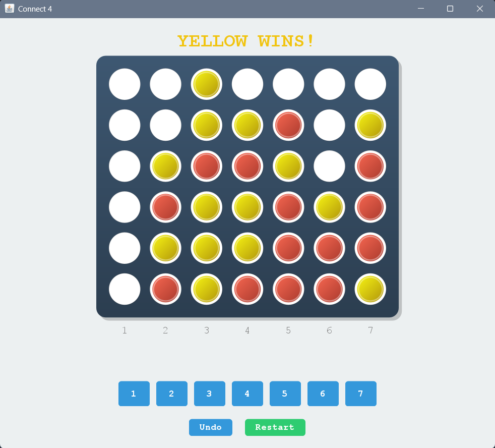

# Connect 4 with Minimax AI

This repository contains a robust implementation of the classic Connect 4 game developed in Java. It features a graphical user interface (GUI) built with Swing and includes an intelligent AI opponent powered by the Minimax algorithm with Alpha-Beta pruning.

## Project Overview

The application allows users to play Connect 4 either against another human player (PvP) or against a computer bot (PvE). The project demonstrates a clean separation of concerns, utilizing the Model-View-Controller (MVC) architectural pattern principles to organize code into logical components:
- **Model**: `GameState.java` manages the internal logic, rules, and state of the game.
- **View**: `Connect4UI.java` and `BoardDrawing.java` handle the graphical presentation and user interaction.
- **Controller/Logic**: `Connect4Bot.java` contains the AI logic.

## Features

- **Interactive GUI**: A responsive interface with custom-painted components for a modern look.
- **Game Modes**:
  - **Player vs Player**: Two users can play on the same machine.
  - **Player vs Bot**: Challenge an AI opponent.
- **Game Controls**:
  - **Undo**: Revert moves to correct mistakes or test different strategies.
  - **Restart**: Quickly reset the board to start a new game.
- **Visual Feedback**: Real-time updates for turn indication, win detection, and error messages (e.g., column full).

## Object-Oriented Programming Concepts

This project extensively utilizes core OOP principles to ensure code maintainability and scalability:

### 1. Encapsulation
The `GameState` class encapsulates the core data of the game, such as the board configuration (`pieces` array), the stack of moves, and the game status flags (e.g., `gameOver`, `redsTurn`). Access to these fields is controlled through public methods like `move()`, `undo()`, and various getters, ensuring the internal state remains consistent and valid.

### 2. Inheritance
The `BoardDrawing` class extends `JComponent`, inheriting the capabilities of a Swing component while adding specific functionality for rendering the game board. Similarly, the UI structure relies on the inheritance hierarchy of Swing classes like `JFrame` and `JPanel`.

### 3. Polymorphism
Polymorphism is demonstrated primarily through method overriding. For instance, `BoardDrawing` overrides the `paintComponent(Graphics g)` method to provide custom rendering logic for the board and pieces. Additionally, anonymous inner classes are used for event listeners, overriding methods like `actionPerformed`.

### 4. Abstraction
The complexity of the game logic is abstracted away from the UI. The `Connect4UI` class does not need to know how a win is calculated or how the board is stored; it simply interacts with the `GameState` object. This separation allows for changes in the game logic without affecting the user interface.

## AI Implementation: Minimax with Alpha-Beta Pruning

The `Connect4Bot` class implements a sophisticated AI using the Minimax algorithm optimized with Alpha-Beta pruning. This allows the bot to look ahead multiple moves to determine the optimal strategy.

### Minimax Algorithm
The Minimax algorithm is a recursive decision-making process used in two-player zero-sum games.
- **Maximizing Player (Bot)**: Tries to choose the move that leads to the highest possible score.
- **Minimizing Player (Human)**: The algorithm assumes the human opponent will play optimally to minimize the bot's score.
- **Recursion**: The algorithm simulates future moves, building a game tree up to a specified depth (currently set to 10).

### Alpha-Beta Pruning
To improve performance and allow for deeper searches, Alpha-Beta pruning is applied. It reduces the number of nodes evaluated in the search tree by stopping the evaluation of a move when at least one possibility has been found that proves the move to be worse than a previously examined move.
- **Alpha**: The best value that the maximizing player is guaranteed at that level or above.
- **Beta**: The best value that the minimizing player is guaranteed at that level or above.
- If `beta <= alpha`, the branch is pruned, saving computational resources.

### Heuristic Evaluation
Since the game tree for Connect 4 is too large to traverse completely, a heuristic evaluation function (`evaluate`) is used when the search reaches the maximum depth.
- **Scoring**: The board is analyzed in "windows" of 4 cells (horizontal, vertical, and diagonal).
- **Weights**:
  - 3 bot pieces + 1 empty: High positive score.
  - 3 opponent pieces + 1 empty: High negative score (priority to block).
  - 2 bot pieces + 2 empty: Moderate positive score.
- **Center Preference**: The algorithm is optimized to prioritize checking center columns first, as they generally offer more winning opportunities.

## How to Run

1.  **Compile the Java files**:
    Open your terminal or command prompt in the `javaConnect4` directory and run:
    ```bash
    javac *.java
    ```

2.  **Run the Application**:
    Execute the main class:
    ```bash
    java Connect4UI
    ```

## Requirements

- Java Development Kit (JDK) 8 or higher.

### Gameplay Screenshots




### Development Team

Application Developed by:
- [Muhammed Razan](github.com/razancodes)
- [Mayank Verma](github.com/mayankvermacs24-droid)
- [Mohammed Nawaal](github.com/AlmostNawaal)
- Mayank Jain;

### Contribution: 
If you feel you have better updates, do open a Pull-Request! 